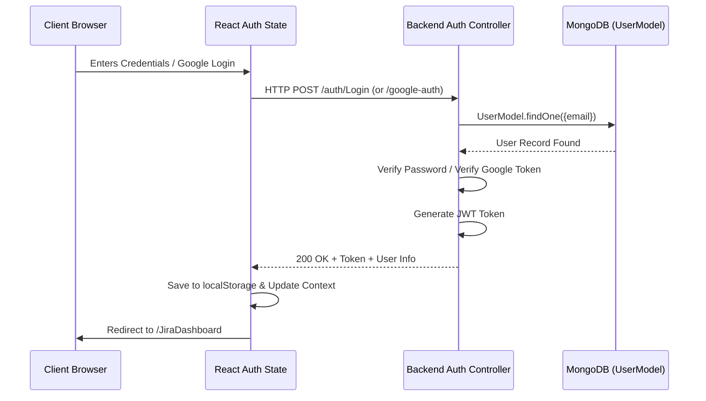

# Authentication System

## 1. Feature Overview
Authentication in Project-Sync is built on a hybrid secure model consisting of local Email/Password authentication (secured using standard hashing protocols) and automated Single Sign-On (SSO) through Google OAuth 2.0.

- **Status:** **Implemented** (JWT & Google OAuth); **Missing** (GitHub Auth & Cookies/Sessions).

---

## 2. What I Learned
- **JWT (JSON Web Tokens):** Safe stateless authorization for API validation.
- **Bcrypt Hashing:** Storing passwords safely in database collections using custom salting factors.
- **Google Client OAuth APIs:** Token-exchange loops involving authorization codes from Google Consent UI.
- **Client Route Guarding:** Restricting client routes dynamically by reading global states.
- **Local Storage Sessions:** Storing user information locally to avoid premature sign-outs (needs context hydration).

---

## 3. How It Was Used In This Project
Authentication is the initial portal of the application.
- **File References:**
  - Frontend Login Form: `frontend/src/pages/auth/LoginOne.jsx`
  - Frontend Registration Form: `frontend/src/pages/auth/Signup.jsx`
  - Frontend Security Wrapper: `frontend/src/pages/auth/ProtectedRoute.jsx`
  - Global Context Provider: `frontend/Context/LoginContext/LoginProvider.jsx`
  - Backend Auth Router: `backend/Routes/AuthRoutes.js`
  - Backend Auth Controller: `backend/auth/LoginandSignup.js`
  - Google Client Setup: `backend/utils/googleClient.js`

### A. Local Email/Password Registration & Login Flow
- Users register via `/Signup` with their Name, Email, and Password.
- The password is encrypted using a `10`-round bcrypt salt before saving to MongoDB.
- During Login, `bcrypt.compare` verifies the submitted password against the hashed record.
- If verified, a JWT token is created containing the user's `id`, `email`, and `name`, signed using `process.env.JWT_SECRET_KEY`.
- The token and basic profile details are returned to the client and stored under `'userInfo'` in `localStorage`.

### B. Google OAuth SSO Flow
- Powered by `@react-oauth/google` on the client side.
- Triggered by calling the `GoogleLogin()` hook with an authorization flow of `'auth-code'`.
- Grabs the code from Google and passes it to `http://localhost:8000/auth/google-auth`.
- The backend trades this code for a Google access token, queries Google's User Info API, registers/fetches the user from `UserModel`, issues a standard local JWT token, and logs the user in.

---

## 4. Project Architecture Notes

---

## 5. Important Code Flow (Interview Preparation)
1. **User Sign Up:**
   - Client sends Name, Email, and Password.
   - Server hashes the password and saves the user record.
   - Redirects client to `/Login`.
2. **User Login:**
   - Client sends Email and Password.
   - Server checks email in the `User` collection.
   - Compares password hash via bcrypt.
   - Returns signed JWT string.
   - Client updates `LoginContext` state (`setLogin(true)`, `setUser(name)`).
   - React Router redirects user to `/JiraDashboard`.
3. **Protected Route Check:**
   - Before mounting Jira Dashboard, `ProtectedRoute` intercepts.
   - Checks if `login` state is true. If false, it redirects back to `/login`.

---

## 6. Future Backend & Production Improvements
- **Context Hydration:** Currently, `LoginProvider` has the `localStorage` rehydration commented out, causing state loss on browser refresh. Enable and validate localStorage parsing safely.
- **Secure Cookies (HTTP-Only):** JWT tokens should not be stored in `localStorage` in production due to XSS vulnerabilities. Transition to `httpOnly` secure cookies.
- **Refresh Tokens:** Implement access token expiration (15 minutes) coupled with secure, long-lived refresh tokens.
- **Rate Limiting:** Protect registration and login routes with `express-rate-limit` to prevent brute force attacks.
