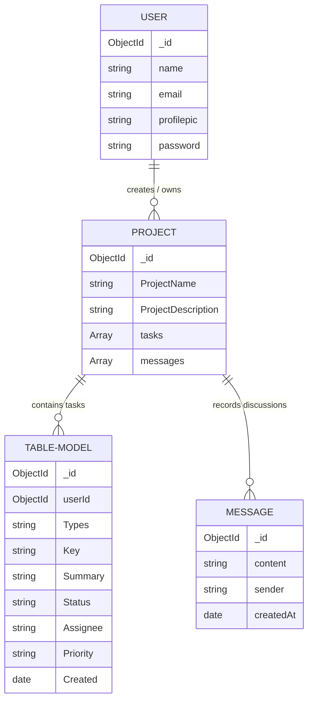

# Database Models

## 1. Feature Overview
Project-Sync relies on MongoDB to persist user sessions, workspaces, collaborative instant messages, and trackable issue table rows. Mongoose (v8) is leveraged as the ODM to establish rigid, object-oriented schemas, define strict validations, and enforce logical data types.

- **Status:** **Implemented** (6 fully configured schema files inside `backend/Models/`).

---

## 2. What I Learned
- **NoSQL Schemas & Mongoose ODMs:** Validating fields, enforcing required tags, and configuring default field initializers.
- **Reference Keys (`ref` / `ObjectId`):** Constructing logical relations between flat document structures using Mongoose references.
- **Enums & Custom Validations:** Restricting text entry strictly to specific allowable choices (e.g. template selections).
- **Automatic Timestamps:** Appending `createdAt` and `updatedAt` dates automatically on record writes.

---

## 3. How It Was Used In This Project
All databases are declared inside `backend/Models/`.

### A. UserModel (`UserModel.js`)
Stores authenticated user credentials.
```javascript
const UserSchema = new mongoose.Schema({
  name: { type: String, required: true },
  email: { type: String, unique: true, required: true },
  profilepic: { type: String },
  password: { type: String }, // Optional if logged in via Google SSO
});
```

### B. Message Model (`Message.js`)
Persists live chat logs.
```javascript
const messageSchema = new mongoose.Schema({
  content: { type: String, required: true },
  sender: { type: String, default: "Anonymous" }
}, { timestamps: true });
```

### C. CreatingProject Model (`Creatingproject.js`)
Represents project workspaces and organizes associated tasks and chats.
```javascript
const CreatingProject = new mongoose.Schema({
  ProjectName: { type: String, required: true },
  ProjectDescription: { type: String },
  tasks: [{ type: mongoose.Schema.Types.ObjectId, ref: "TableModel" }], 
  messages: [{ type: mongoose.Schema.Types.ObjectId, ref: "Message" }], 
}, { timestamps: true });
```

### D. ProjectTemplate Model (`Projecttemplate.js`)
Restricts the allowable structures of pre-built environments.
```javascript
const ProjectTemplate = new mongoose.Schema({
  TemplateName: {
    type: String,
    enum: ["Jira", "Kanban", "Dev"],
    required: true
  }
});
```

### E. TableModel (`TableRowData.js`)
Stores tracking information for spreadsheet row tasks.
```javascript
const TableSchema = new mongoose.Schema({
  userId: { type: mongoose.Schema.Types.ObjectId, ref: "User", required: false },
  Types: { type: String },
  Key: { type: String },
  Summary: { type: String },
  Status: { type: String },
  comment: { type: String },
  Assignee: { type: String, default: "Devansh Jain" },
  Priority: { type: String },
  Created: { type: Date, default: Date.now },
  Updated: { type: String },
  Reporter: { type: String },
});
```

---

## 4. Schema Relationships & Entity Map


---

## 5. Future Backend & Production Improvements
- **Password Obfuscation Middleware:** Integrate pre-save Mongoose hooks (`UserSchema.pre('save')`) to hash passwords inside the schema definition itself, keeping controller code simpler.
- **Reference Integrity Controls:** Currently, Project-Sync links `tasks` inside `CreatingProject` but doesn't auto-remove them if the parent project is deleted. Establish pre-remove cascading triggers.
- **Strict Indexing:** Set database indices on frequently-queried columns (e.g. `userId` or project `Key`) to optimize query processing times in production.
